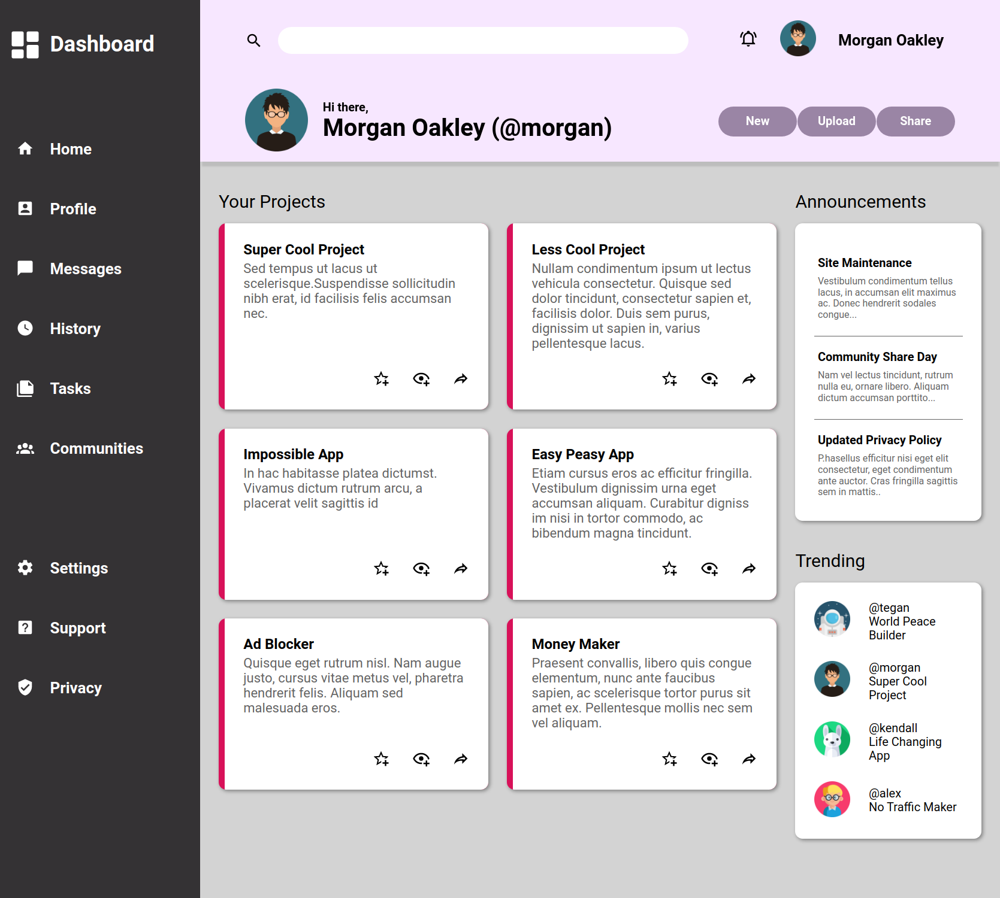

# Admin-Dashboard
This is a frontend project from [The Odin Project](https://www.theodinproject.com/lessons/node-path-intermediate-html-and-css-admin-dashboard) using css grid and flexbox. 

## <a href="https://rommelmabinijr.github.io/admin-dashboard/" >Live Preview</a>

## Resources Used
- Avatar photos for demonstration all retrieved from [Flaticon](https://www.flaticon.com/search/2?word=avatars&order_by=4)
- Icons used from [Material Design Icons](https://materialdesignicons.com/)